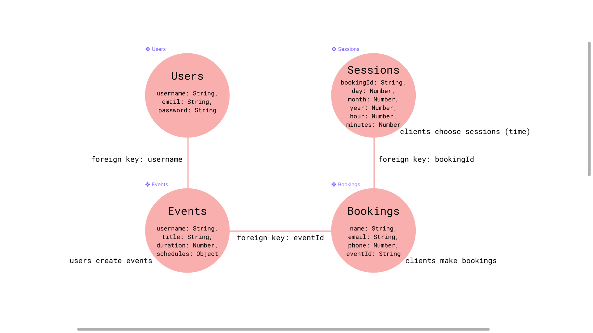

## Backend for appointment application


If you don't have `nodemon` installed. Install it globally on your machine.

```
npm install -g nodemon
```

`nodemon` will restart the server automatically for you whenever there's a change.

Start the server
```
npm install
nodemon index.js
```